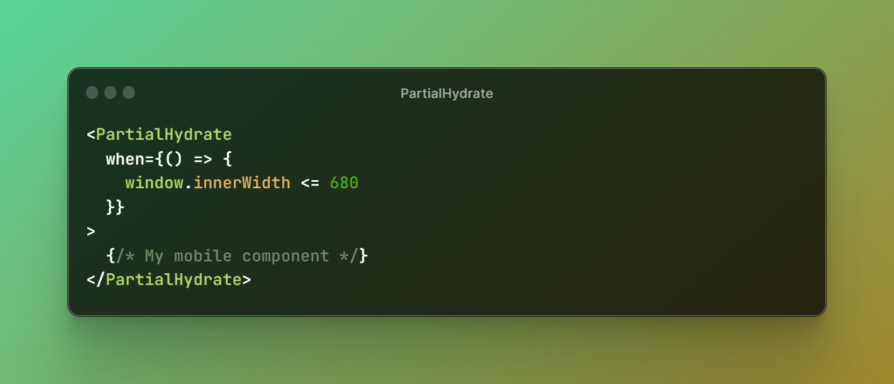

# Partial Hydrate [![npm version][npm-image]][npm-url]  [![Downloads][downloads-image]][npm-url] [](https://github.com/actions/checkout/actions/workflows/test.yml)

## Introduction


Provides a `<PartialHydrate>` component that conditionally _skips hydrating children_ by removing them from the DOM _before the first client render_. Removing them before ensures hydration is successful and there are no hydration mismatch errors.

## Install

```
npm i partial-hydrate
```

## Usage

```tsx
<PartialHydrate
  when={() => {
    window.innerWidth <= 680
  }}
>
  {/* My mobile component */}
</PartialHydrate>
```

## Props

- `minWidth`: will render if window width is greater than `minWidth` value.
- `maxWidth`: will render if window width is lesser than `maxWidth` value.
- `when()`: `function` that must return `true` for the render to happen.

### Use with minWidth and/or maxWidth

You can use the `minWidth` and/or `maxWidth` props individually or together to conditionally render components based on the window width. Here's an example:

```tsx
const MyComponent = () => {
  return (
    <PartialHydrate minWidth={768}>
      { /* Rendered if window width is greater than or equal to 768 pixels */ }
    </PartialHydrate>

    <PartialHydrate maxWidth={1024}>
      { /* Rendered if window width is less than or equal to 1024 pixels */ }
    </PartialHydrate>

    <PartialHydrate minWidth={768} maxWidth={1024}>
      { /* Rendered if window width is between 768 and 1024 pixels (inclusive) */ }
    </PartialHydrate>
  )
}
```

### Use with when()

The `when()` prop allows for a custom condition based on a function. It is particularly useful for your _dynamic conditions_. For example:

```tsx
const MyComponent = () => {
  return (
    <PartialHydrate when={() => someDynamicCondition()}>
      {/* Rendered if the custom condition specified in the `when()` function is true */}
    </PartialHydrate>
  )
}
```

## Use case

When using React's server-side rendering, we often need to render components on the server even if they are conditional on the client _e.g. hidden based on window width_.

In order for hydration to succeed, the first client render must match the DOM (which is generated from the HTML returned by the server), otherwise we will get hydration mismatch errors. This means the component must be rendered again during the first client render.

However, hydration is expensive, so we really don't want to pay that penalty only for the element to be hidden or removed immediately afterwards.

## Caveats

So is this another react _responsive_ rendering library? Nope. If the prop conditions are not met, then `<PartialHydrate>`'s children are never rendered.

#### ✋ Keep in mind

Also, keep in mind that using `<PartialHydrate>` does not work on window resize and it is not meant to!

## Authors

Based on a gist by [OliverJAsh](https://github.com/OliverJAsh). Developed, modified and maintained by [George Cht](https://github.com/GeorgeCht).

- George Cht ([@GeorgeCht](https://github.com/GeorgeCht))
- Oliver Joseph Ash ([@OliverJAsh](https://github.com/OliverJAsh))

## License

[MIT License](https://opensource.org/licenses/MIT)

[downloads-image]: http://img.shields.io/npm/dm/partial-hydrate.svg
[npm-url]: https://www.npmjs.com/package/partial-hydrate
[npm-image]: http://img.shields.io/npm/v/partial-hydrate.svg
